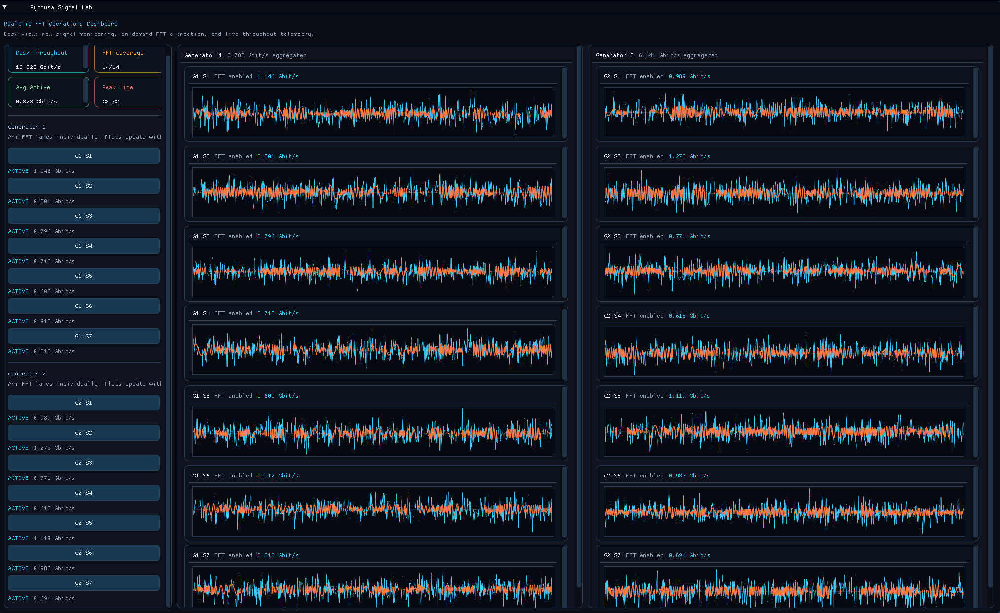
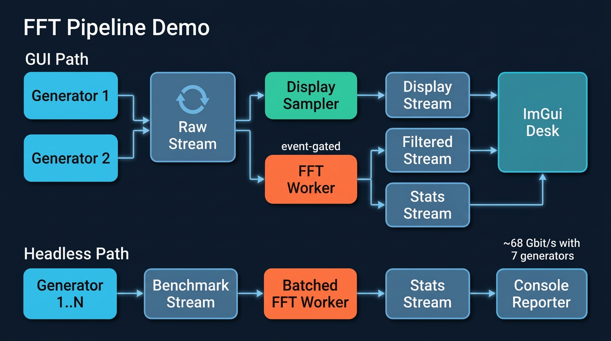
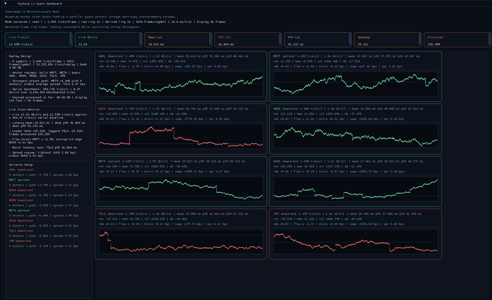
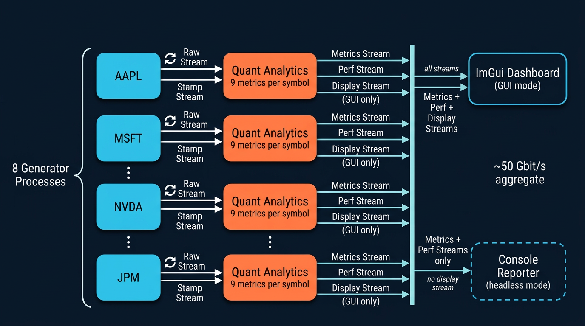

# Showcase Demos

## 73 Gbit/s FFT signal payload. 50 Gbit/s market data throughput. Pure Python. MacBook Air M2.

No C extensions. No Cython. Just `multiprocessing.shared_memory` and PYTHUSA.

These two demos push PYTHUSA to its limits and show what a pure-Python shared-memory pipeline can do when the transport layer gets out of the way. Both include an interactive ImGui operator desk and a headless benchmarking mode that strips the GUI to measure raw throughput.

All commands below assume you are in the `pythusa/` project root with the package installed (`pip install -e ".[examples]"`).

---

## FFT Pipeline Demo

**~73 Gbit/s sustained FFT signal payload. ~140,000 FFT/s across 49 signals. Pure Python.**

A multi-channel FFT pipeline that streams synthetic sensor data through shared-memory ring buffers into parallel FFT workers. The default 2-generator configuration hits ~21 Gbit/s at around 30% CPU utilization -- leaving massive headroom. Crank it to 7 generators and the pipeline delivers **73 Gbit/s** of FFT input payload, enough to service roughly **17,000 NI USB-6423-class DAQ channels** simultaneously.


*ImGui operator desk: live signal traces, on-demand FFT extraction, and per-channel throughput telemetry.*

### Architecture



### Performance

| Mode | Generators | Signals | FFT window | Throughput | FFT rate |
| --- | --- | --- | --- | --- | --- |
| `throughput` | 2 (default) | 14 | 8192 samples | ~21 Gbit/s | ~40k FFT/s |
| `throughput` | 7 | 49 | 8192 samples | **~73 Gbit/s** | **~140k FFT/s** |
| `latency` | 2 (default) | 14 | 1024 samples | ~5.8 Gbit/s | ~88k FFT/s |

Throughput is **FFT input signal payload** -- the data consumed by the analysis path, not total DRAM bandwidth or temporary array traffic. Scaling from 2 to 7 generators yields a **3.4x throughput increase** by filling CPU headroom that the default configuration leaves unused.

### What it exercises

- **Zero-copy shared-memory streams** -- data never gets pickled. Producers write frames into ring buffers; consumers read them through memoryviews.
- **Pipeline DAG compilation** -- validates topology at build time, catches missing bindings and cycles, topologically sorts task startup.
- **Event-driven task gating** -- FFT workers sleep until an operator arms them, then run continuously once signaled.
- **Concurrent fanout** -- the same generator stream feeds both the display path and the analysis path without duplicating data.
- **Dynamic scaling** -- `--generators N` adds generator/FFT-worker pairs to fill available CPU headroom.

### Signal shape

| Parameter | Value |
| --- | --- |
| Signals per generator | 7 |
| Sample rate | 61.44 kS/s per signal |
| Signal composition | 16 randomized sinusoids + Gaussian noise per channel |

### Run

```bash
# GUI mode -- live dashboard with signal plots and FFT arm buttons
python examples/fft_pipeline_demo/main.py

# Headless throughput (default 2 generators, ~21 Gbit/s)
python examples/fft_pipeline_demo/main.py --headless --mode throughput --duration 10 --report-interval 1

# Scaled-up throughput (7 generators, ~73 Gbit/s)
python examples/fft_pipeline_demo/main.py --headless --mode throughput --generators 7 --duration 10 --report-interval 1

# Latency mode (1024-sample FFT window, ~88k FFT/s)
python examples/fft_pipeline_demo/main.py --headless --mode latency --duration 10 --report-interval 1
```

Each `--generators N` creates N data producers and N FFT consumers (plus one console reporter), so `--generators 7` spawns 15 worker processes.

### Flags

| Flag | Default | Purpose |
| --- | --- | --- |
| `--headless` / `--no-gui` | off | Disable ImGui, print benchmark stats to stdout |
| `--mode` | `throughput` | `throughput` (8192-row FFT) or `latency` (1024-row FFT) |
| `--generators N` | 2 | Number of generator/FFT-worker pairs in headless mode |
| `--frame-rows N` | (from mode) | Override the FFT frame length for custom sweeps |
| `--duration SEC` | unlimited | Stop after a fixed interval |
| `--report-interval SEC` | 1.0 | Print cadence in headless mode |

---

## Stock Quant Demo

**~50 Gbit/s aggregate market data throughput. 8 symbols. 9 live quant metrics per symbol. Pure Python.**

A simulated L3 market microstructure replay desk that would normally require C++ or Java infrastructure. Eight parallel generators stream synthetic 3-level order-book snapshots and trade prints through shared-memory ring buffers into per-symbol quant analytics workers -- computing session returns, momentum, volatility, drawdown, depth imbalance, flow z-scores, microprice edge, VWAP deviation, and spread in real time with end-to-end latency tracking and speedup measurement against a serial baseline.


*ImGui dashboard: 8-symbol cross-section with live midprice traces, EMA overlays, quant metric cards, and per-symbol throughput and latency.*

### Architecture



### Performance

| Profile | Throughput | Symbols | Metrics/symbol | Latency tracking |
| --- | --- | --- | --- | --- |
| `throughput` | **~50 Gbit/s** | 8 | 9 | mean, p50, p95, p99 |
| `balanced` | moderate | 8 | 9 | mean, p50, p95, p99 |
| `latency` | lower | 8 | 9 | mean, p50, p95, p99 |

The pipeline reports aggregate **ticks/s**, **Gbit/s** payload, **frame-latency percentiles**, and **parallel speedup** against the serial baseline measured at startup.

### What it exercises

- **One generator process per symbol** -- writes 3-level order-book snapshots and trade prints into shared-memory streams. No pickling, no serialization.
- **One analytics process per symbol** -- reads raw book data through zero-copy memoryviews and computes a full suite of microstructure metrics per frame.
- **End-to-end latency tracking** -- stamps each frame at publish and measures time to analytics completion (mean, p50, p95, p99).
- **Speedup against a serial baseline** -- runs the same quant math single-threaded at startup and reports the live parallel speedup factor.
- **Runtime profiles** -- tune the pipeline for latency, throughput, or a balanced default by adjusting frame size, ring depth, and report cadence.

### Universe

| Symbol | Sector | Description |
| --- | --- | --- |
| AAPL | Tech | Large-cap consumer electronics |
| MSFT | Tech | Large-cap enterprise software |
| NVDA | Semis | Large-cap GPUs and accelerators |
| AMZN | Tech | Large-cap e-commerce and cloud |
| META | Tech | Large-cap social media |
| GOOG | Tech | Large-cap search and cloud |
| TSLA | Auto | Large-cap electric vehicles |
| JPM | Finance | Large-cap investment bank |

### Quant metrics

| Metric | What it measures |
| --- | --- |
| Session return | Cumulative return from the session anchor price |
| Momentum | Short-horizon return over a 256-tick window |
| Realized volatility | Annualized std-dev of log returns (512-tick window) |
| Drawdown | Decline from session peak midprice |
| Depth imbalance | (total bid - total ask) / total depth across 3 levels |
| Signed-flow z-score | Extremeness of latest signed trade notional vs. rolling window |
| Microprice edge | Size-weighted midprice deviation from simple midprice (bps) |
| VWAP deviation | Current midprice vs. session VWAP (bps) |
| Spread | Inside spread (bps) |

### Runtime profiles

| Profile | Ticks/frame | Raw ring depth | Idle sleep | Best for |
| --- | --- | --- | --- | --- |
| `latency` | 256 | 4 frames | 10 us | Minimizing frame delay |
| `balanced` | 2048 | 16 frames | 100 us | General interactive use |
| `throughput` | 8192 | 32 frames | 200 us | Maximum aggregate payload |

### Run

```bash
# GUI mode -- 960x600 dashboard with live cross-section
python examples/stock_quant_demo/main.py

# Headless throughput benchmark (~50 Gbit/s)
python examples/stock_quant_demo/main.py --headless --mode throughput --bank-gb 1 --duration 20 --report-interval 1

# Headless latency benchmark
python examples/stock_quant_demo/main.py --headless --mode latency --bank-gb 1 --duration 20 --report-interval 1
```

`--bank-gb` controls the precomputed replay bank size; smaller values (e.g. 1) reduce startup time while still saturating the pipeline.

### Flags

| Flag | Default | Purpose |
| --- | --- | --- |
| `--mode` | `balanced` | Runtime profile: `latency`, `balanced`, or `throughput` |
| `--seed` | 7 | Simulation RNG seed for reproducibility |
| `--bank-gb` | 4.0 | Target total precomputed replay bank size in GB |
| `--headless` | off | Disable ImGui, print stats to stdout |
| `--duration` | unlimited | Stop after N seconds in headless mode |
| `--report-interval` | 1.0 | Seconds between headless console reports |

---

## More Examples

Beyond the showcase demos, `examples/` includes smaller scripts that highlight specific PYTHUSA features:

- `python examples/basic_workers.py` -- raw `Manager` plus `SharedRingBuffer` usage.
- `python examples/engine_dsp_pipeline.py` -- larger `Pipeline` example with plotting, monitoring, and real DSP-style stages. Install `.[examples]` first.
- `python examples/fir128_scaling_pipeline.py` -- round-robin FIR128 fan-out/fan-in scaling example over engine-data-derived signals.

---

Want to see the code that makes this possible? **[Under the Hood](internals.md)** -- a guided walkthrough of the ring buffer, zero-copy memoryviews, and cached backpressure that power these numbers.
