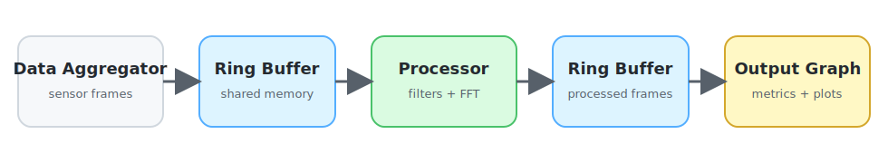

# PYTHUSA

PYTHUSA is a Python-first shared-memory runtime for fixed-shape NumPy data pipelines.
It is built for workloads where you want multiple Python processes moving numeric frames between stages with low overhead and explicit control over latency, throughput, and backpressure.



**[Showcase Demos](demos.md)** -- FFT pipeline hitting **~73 Gbit/s** across 49 signals and a market microstructure replay desk pushing **~50 Gbit/s** across 8 symbols with live quant analytics. No C extensions. Performance numbers, architecture diagrams, and run commands.

## What PYTHUSA Is

The simplest mental model is a factory line:

- tasks are the machines
- streams are the conveyor belts
- events are the switches and gates

You write the processing code inside the tasks.
PYTHUSA handles:

- shared-memory transport
- worker process setup
- reader and writer wiring
- event sharing
- monitoring and ring pressure reporting

## Start Here

- [Pipeline API](pipeline.md)
  The main public API. Start here if you want to build a graph of streams, tasks, and events.
- [Runtime](runtime.md)
  The lower-level layer under `Pipeline`. Use this if you need direct ring or process control.
- [Benchmarks](benchmarks.md)
  Benchmark modes, output conventions, and current benchmarking entry points.

## Quick Start

```python
from __future__ import annotations

import time
import numpy as np
import pythusa


FRAME = np.arange(8, dtype=np.float32)


def source(samples) -> None:
    samples.write(FRAME)


def scale(samples, doubled) -> None:
    while True:
        frame = samples.read()
        if frame is None:
            time.sleep(0.001)
            continue
        doubled.write((frame * 2.0).astype(np.float32, copy=False))
        return


def sink(doubled) -> None:
    while True:
        frame = doubled.read()
        if frame is None:
            time.sleep(0.001)
            continue
        print(frame)
        return


def main() -> None:
    with pythusa.Pipeline("demo") as pipe:
        pipe.add_stream("samples", shape=(8,), dtype=np.float32)
        pipe.add_stream("doubled", shape=(8,), dtype=np.float32)

        pipe.add_task("source", fn=source, writes={"samples": "samples"})
        pipe.add_task(
            "scale",
            fn=scale,
            reads={"samples": "samples"},
            writes={"doubled": "doubled"},
        )
        pipe.add_task("sink", fn=sink, reads={"doubled": "doubled"})

        pipe.run()


if __name__ == "__main__":
    main()
```

On Windows and other `spawn`-based multiprocessing environments, keep `pipe.start()` and `pipe.run()` inside a `main()` guarded by `if __name__ == "__main__":`.

## Core Ideas

### Streams

Streams move fixed-shape, fixed-dtype NumPy frames between tasks.
At compile time, a stream becomes a shared-memory ring buffer sized in bytes.

### Tasks

Tasks are normal Python callables.
Today, one registered task maps to one worker process.

### Events

Events are process-shared control primitives used to gate or trigger work.
Use them when a task should react to a signal instead of running unconditionally.

## What To Read Next

- Read [Under the Hood](internals.md) for a guided walkthrough of the hot path -- the code behind 73 Gbit/s.
- Read [Pipeline API](pipeline.md) for the high-level programming model.
- Read [Runtime](runtime.md) if you need to understand ring buffers, task bootstrap, or raw ring access.
- Read [Benchmarks](benchmarks.md) if you want to compare throughput and latency modes.

## Install

PYTHUSA currently targets Python 3.12 only.

### Install From PyPI

```bash
python -m pip install pythusa
```

Optional extras from PyPI:

```bash
python -m pip install "pythusa[test]"
python -m pip install "pythusa[examples]"
python -m pip install "pythusa[benchmarks]"
```

### Install From Source

#### macOS / Linux

```bash
python3.12 -m venv .venv
source .venv/bin/activate
python -m pip install -e .
```

#### Windows PowerShell

```powershell
py -3.12 -m venv .venv
.venv\Scripts\Activate.ps1
python -m pip install -e .
```

Optional extras:

```bash
python -m pip install -e ".[test]"
python -m pip install -e ".[examples]"
python -m pip install -e ".[benchmarks]"
```

## Examples

See **[Showcase Demos](demos.md)** for the two flagship examples with full architecture walkthroughs, performance numbers, and run commands:

- **FFT Pipeline Demo** -- ~73 Gbit/s sustained, ~140k FFT/s across 49 signals with 7 generators.
- **Stock Quant Demo** -- 8-symbol L3 order-book replay with live quant analytics, latency tracking, and serial-baseline speedup.

Smaller standalone scripts:

- `python examples/basic_workers.py` -- raw `Manager` plus `SharedRingBuffer` usage.
- `python examples/engine_dsp_pipeline.py` -- larger `Pipeline` example with plotting, monitoring, and real DSP-style stages. Install `.[examples]` first.
- `python examples/fir128_scaling_pipeline.py` -- round-robin FIR128 fan-out/fan-in scaling example over engine-data-derived signals.

## License

PYTHUSA is licensed under the GNU General Public License, version 2 only (`GPL-2.0-only`).
See the repository `LICENSE` file for the full license text.
